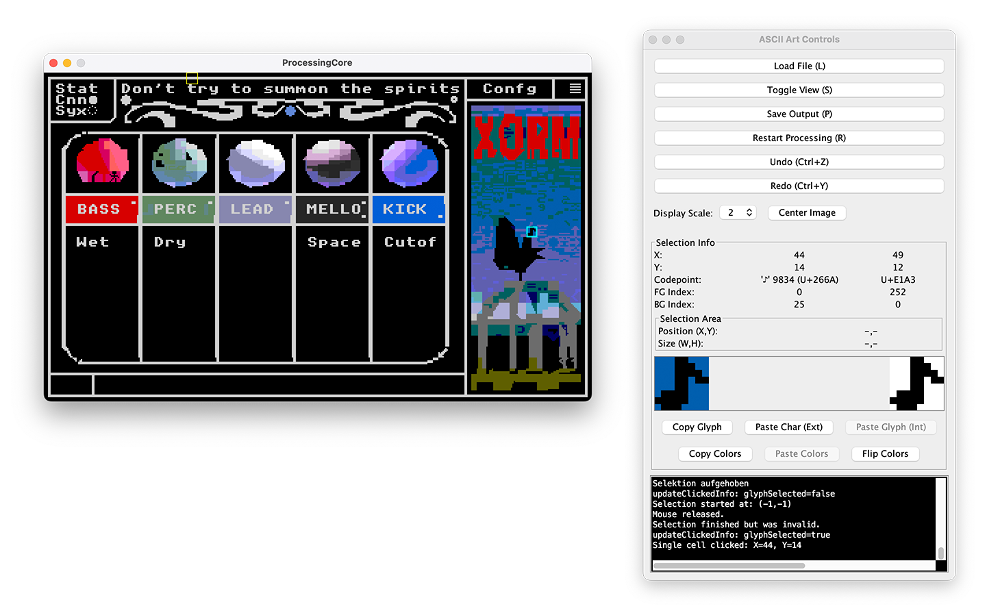
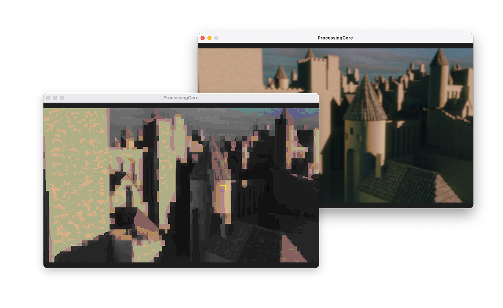
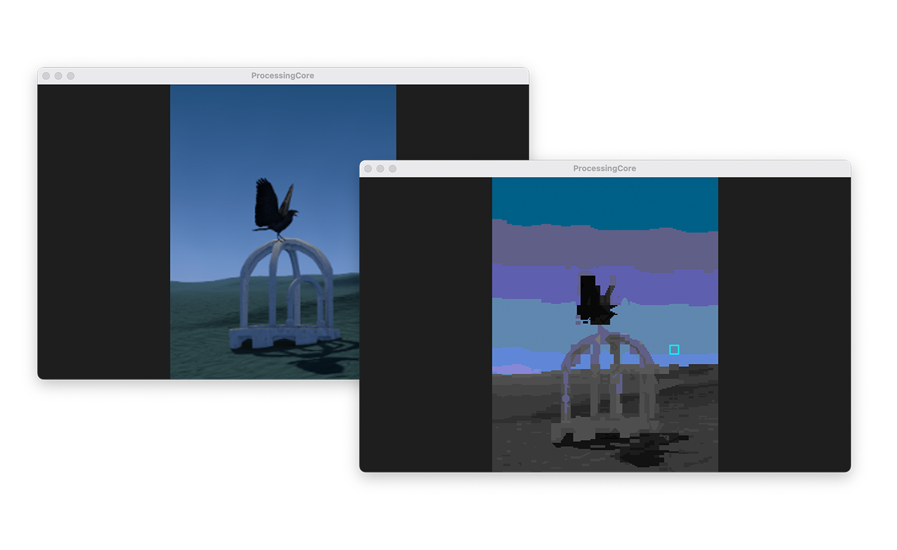
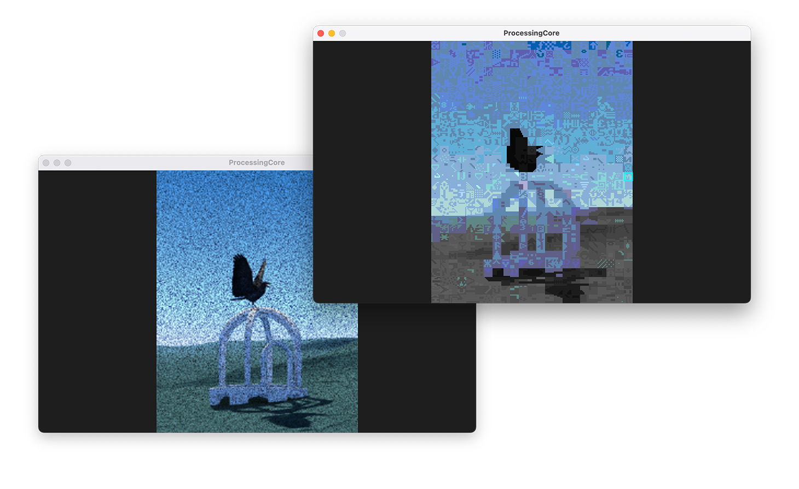

# UNSCII Generator V2

A Java application for converting images into ASCII art using the awesome [unscii](https://github.com/viznut/unscii) font (8x8 only) and the xterm-256 color palette, built with Processing and Swing. The pattern matching is exact enough that you can design actual things like UI with it. I am using it for my personal terminal based software thats running on a Pi.

This code is really mainly build by me telling an AI what I want. I was making minor manual fixups. Thats why some things are still German, the AI was switching between languages. Also this thing is really tailored to my needs, probably not verrrry useful for anybody but feel free to fork and send pull requests. Would be interesting to see where this goes when adding support for more fonts. The app is version 2 because AI destroyed my version 1 before I saved it. All Hail the new Gods. 

This example shows how I am using the generators capabilites to find the exact match to design my TextBased Ui. Make sure you carefully place your symbols so that they match the 8x8 grid of the [unscii](https://github.com/viznut/unscii) Font. This way you can really build Text UI by just painting an image and throwing it into the generator.

Adding some noise to the image makes the result more interesting and helps to display gradients in a better way! Somebody should try it with some actual dithering patterns.

_All media is taken from my personal project [Xorm](https://www.instagram.com/xorm_epos)_

## Features

*   **Image Loading:** Load various image formats (JPG, PNG, GIF, BMP). Supports Alpha Channel (v2.11)
*   **UNSCII Conversion:** Convert images into a grid of characters based on the [unscii](https://github.com/viznut/unscii) 8x8 font patterns.
*   **Color Matching:**
    *   Uses the standard xterm-256 color palette.
    *   Supports exact 2-color matching for optimal representation where possible.
    *   Falls back to approximate matching using dominant colors.
*   **Interactive Editing:**
    *   View the source image or the generated ASCII art.
    *   Zoom and pan the view.
    *   Select individual glyphs (characters) to inspect their properties (codepoint, foreground/background color indices).
    *   Modify selected glyphs:
        *   Change the character.
        *   Swap foreground and background colors.
        *   Paste characters from the system clipboard.
        *   Copy/paste entire glyph data (character + colors) internally.
        *   Copy/paste only color data internally.
*   **Undo/Redo:** Supports undoing and redoing edits.
*   **Selection:** Select rectangular areas.
*   **Saving:** Save the generated ASCII art to a custom `.usc2` file format.
*   **Control Panel:** A separate Swing window provides controls for loading, saving, toggling views, scaling, editing, and viewing selection details.

### File Format

The File Format is a readable text format. You can open it in a texteditor. I added some java parsing classes to the source that can parse it for you if you want to use the text somehow. 

### Prerequisites

*   **Java Development Kit (JDK):** Version 8 or higher recommended.
*   **Processing:** The Processing core library (`core.jar`) is required. You typically need to install the Processing IDE and locate the `core.jar` file within its installation directory (e.g., `Processing/core/library/core.jar`).

### Running the Application

Download the .jar from the releases or use the one in the root folder. It should just start up. This is a very early version, only tested on one machine. Feel free to fork and send push requests.

## Usage

1.  **Launch:** Run the application as described above. The main Processing window and the Control Panel will appear.
2.  **Load Image:** Use the "Load File (L)" button in the Control Panel to select an image.
3.  **View/Edit:**
    *   The image will be converted and displayed in the Processing window.
    *   Use the "Toggle View (S)" button or the 'S' key to switch between the source image and the ASCII art.
    *   Use the mouse wheel or number keys (1-8) to zoom.
    *   Right-click and drag to pan.
    *   Click on a character in the ASCII art view to select it. Its details will appear in the "Selection Info" section of the Control Panel.
    *   Use the copy/paste/flip buttons or keyboard shortcuts (listed in tooltips and code) in the Control Panel to edit the selected glyph.
    *   Click and drag to select a rectangular area.
4.  **Save:** Use the "Save Output (P)" button or the 'P' key to save the result as a `.usc2` file.
    * If you have a selection box active, only the selection will be saved.

## Dependencies

*   Java SE (JDK) Classversion 60.0
*   Processing Core Library (`core.jar`)
*   Java Swing (for the Control Panel - part of standard Java SE)

## Known Issues

* shortcuts other than the cmd+... are not working
* runs only on 50x30 glyphs because thats what i needed it to do

## Todo

- [ ] Make Shorcuts work again
- [ ] Add batch processing of multiple images
- [ ] Write a .unc2 importer 
- [ ] add some basic image editing to change contrasts, hue and saturation and add noise
- [ ] export the result as a png for casual use
